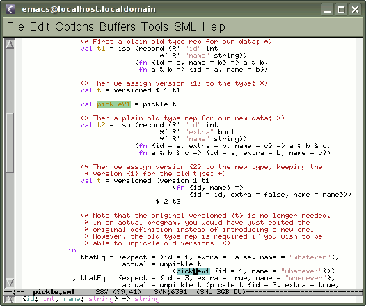

= EmacsDefUseMode

MLton provides an <<CompileTimeOptions#,option>>,
``-show-def-use __file__``, to output precise (giving exact source
locations) and accurate (including all uses and no false data)
whole-program def-use information to a file.  Unlike typical tags
facilities, the information includes local variables and distinguishes
between different definitions even when they have the same name.  The
def-use Emacs mode uses the information to provide navigation support,
which can be particularly useful while reading SML programs compiled
with MLton (such as the MLton compiler itself).

== Screen Capture

Note the highlighting and the type displayed in the minibuffer.

== Features

* Highlights definitions and uses.  Different colors for definitions, unused definitions, and uses.
* Shows types (with highlighting) of variable definitions in the minibuffer.
* Navigation: `jump-to-def`, `jump-to-next`, and `jump-to-prev`.  These work precisely (no searching involved).
* Can list, visit and mark all references to a definition (within a program).
* Automatically reloads updated def-use files.
* Automatically loads previously used def-use files at startup.
* Supports both http://www.gnu.org/software/emacs/[Gnu Emacs] and http://www.xemacs.org[XEmacs].

== Download

There is no separate package for the def-use mode although the mode
has been relatively stable for some time already.  To install the mode
you need to get the Emacs Lisp, `*.el`, files from MLton's repository:
https://github.com/MLton/mlton/tree/master/ide/emacs[`emacs`].  The easiest way to get the files
is to use <<Git#>> to access MLton's <<Sources#,sources>>.

/////
If you only want the Emacs lisp files, you can use the following
command:
----
svn co svn://mlton.org/mlton/trunk/ide/emacs mlton-emacs-ide
----
/////

== Setup

The easiest way to load def-use mode is to first tell Emacs where to
find the files.  For example, add

[source,cl]
----
(add-to-list 'load-path (file-truename "path-to-the-el-files"))
----

to your `~/.emacs` or `~/.xemacs/init.el`.  You'll probably
also want to start `def-use-mode` automatically by adding

[source,cl]
----
(require 'esml-du-mlton)
(def-use-mode)
----

to your Emacs init file.  Once the def-use mode is activated, you
should see the `DU` indicator on the mode line.

== Usage

To use def-use mode one typically first sets up the program's makefile
or build script so that the def-use information is saved each time the
program is compiled.  In addition to the ``-show-def-use __file__``
option, the ``-prefer-abs-paths true`` expert option is required.
Note that the time it takes to save the information is small (compared
to type-checking), so it is recommended to simply add the options to
the MLton invocation that compiles the program.  However, it is only
necessary to type check the program (or library), so one can specify
the ``-stop tc`` option.  For example, suppose you have a program
defined by an MLB file named `my-prg.mlb`, you can save the def-use
information to the file `my-prg.du` by invoking MLton as:

----
mlton -prefer-abs-paths true -show-def-use my-prg.du -stop tc my-prg.mlb
----

Finally, one needs to tell the mode where to find the def-use
information.  This is done with the `esml-du-mlton` command.  For
example, to load the `my-prg.du` file, one would type:

----
M-x esml-du-mlton my-prg.du
----

After doing all of the above, find an SML file covered by the
previously saved and loaded def-use information, and place the cursor
at some variable (definition or use, it doesn't matter).  You should
see the variable being highlighted.  (Note that specifications in
signatures do not define variables.)

You might also want to setup and use the
<<EmacsBgBuildMode#,Bg-Build mode>> to start builds automatically.

== Types

`-show-def-use` output was extended to include types of variable
definitions in revision https://github.com/MLton/mlton/search?q=SVN+r6333&type=commits[`r6333`].  To get good type names, the
types must be in scope at the end of the program.  If you are using the
<<MLBasis#,ML Basis>> system, this means that the root MLB-file for your
application should not wrap the libraries used in the application inside
`local ... in ... end`, because that would remove them from the scope before
the end of the program.
